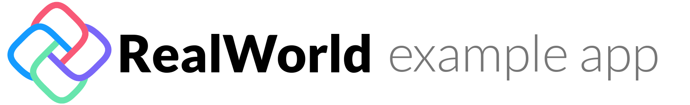

# 

> ### UNO Platform codebase containing real world examples (CRUD, auth, advanced patterns, etc) that adheres to the [RealWorld](https://github.com/gothinkster/realworld) spec and API.

### [Demo](https://github.com/gothinkster/realworld)&nbsp;&nbsp;&nbsp;&nbsp;[RealWorld](https://github.com/gothinkster/realworld)

This codebase was created to demonstrate a fully fledged fullstack application built with **UNO Framework** including CRUD operations, authentication, routing, pagination, and more.

We've gone to great lengths to adhere to the UNO Platform community styleguides & best practices.

For more information on how to this works with other frontends/backends, head over to the [RealWorld](https://github.com/gothinkster/realworld) repo.

# How it works

The Real World application is presented as a SOA (Service Oriented Architecture) backed website and native client platform.  Utilizing the advanced features of UNO Platform, the following clients are presented here:
* UWP - Universal Windows Platform
* WASM Web - Website compiled to WASM
* Android - Uses Xamarin Android platform
* iOS - Uses Xamarin iOS platform

The services are presented using the standard REST API of the project specification and implemented in ASP.Net Core WebAPI with SQLite backend.

# Getting Started

You will need Visual Studio 2019 (the _free_ Community version is fine) with the UNO Platform extension installed.  Dotnet Core 3.0.2 is used for the non UWP projects.